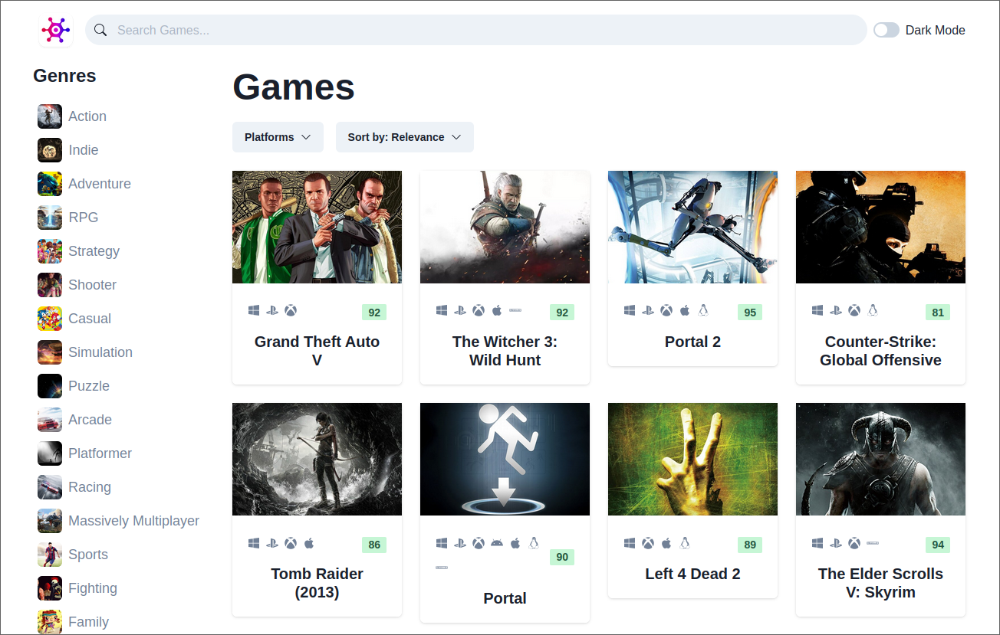

# Game Hub Library

This project aims to demonstrate my abilitiy to communicate with APIs, to aquire, filter and be able to search through data. And handle error and load states effectively

Here RAWG API was used. RAWG is a service which boasts 'The biggest video game database' .

## Features

- Fully responsive
- Modern UI/UX design using Chakra UI
- Light and dark modes

- Error handling

  - Loading states
  - Conditional rendering based on server responses

- Filtering results by
  - Genres
  - Platforms (PC, xbox etc)
  - Sorting (Name, date etc)
  - Search functionality

# Tech Stack

 - React + TypeScript
 - ChakraUI
 - Axios + React Query
