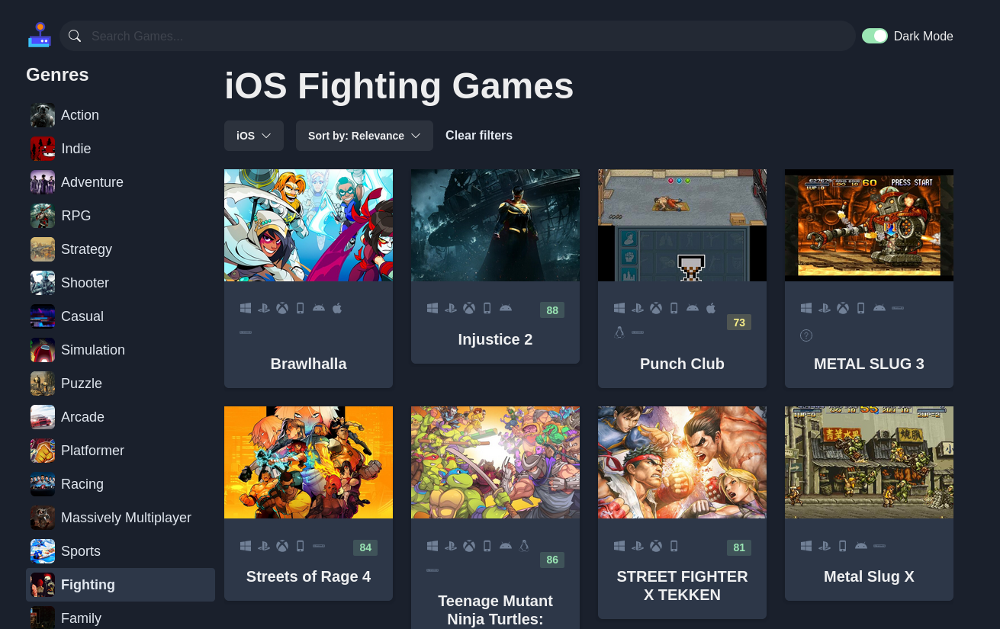

# Game Hub Library

In this project RAWG API, a service which boasts 'The biggest video game database' was used to demonstrate an ability pull, display and manage data from a backend.

Axios API and React Query library were used to communicate with RAWG. Various functionality was implemented like sorting, filtering, searching and more

## Features

- Fully responsive
- Modern UI/UX design using Chakra UI
- Light and dark modes

- Error handling

  - Loading states/skeletons when pulling data
  - Conditional rendering based on server responses

- Filtering results by

  - Genres
  - Platforms (PC, xbox etc)
  - Sorting (Name, date etc)
  - Search functionality

- Data caching using react query

# Tech Stack

- React, React router, TypeScript
- ChakraUI
- Axios + React Query
- Global state management using Zustand
